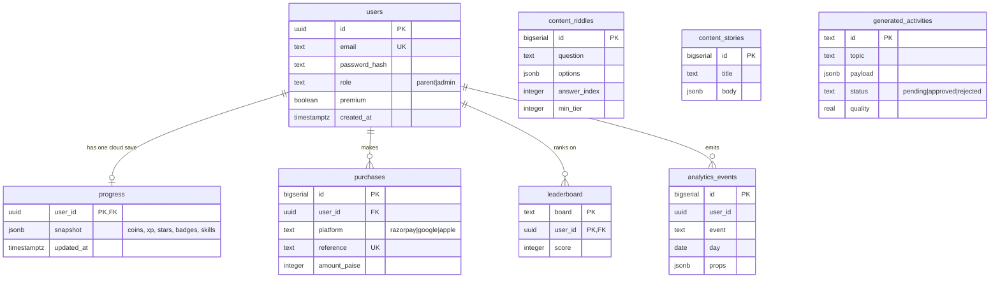

# BrainBooster — Entity-Relationship Diagram

## Notes
- **COPPA-friendly:** children have no accounts. Child profiles live inside `progress.snapshot`.
- `0001_init.sql` owns the shipping tables (users, progress, purchases, content_*).
- `0002_services.sql` adds the tables that back the extracted services (leaderboard, analytics, content generation queue). These are additive — the monolith server ignores them.
